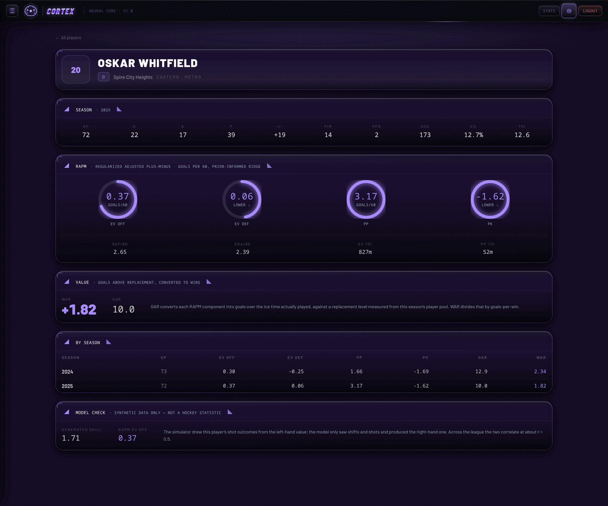
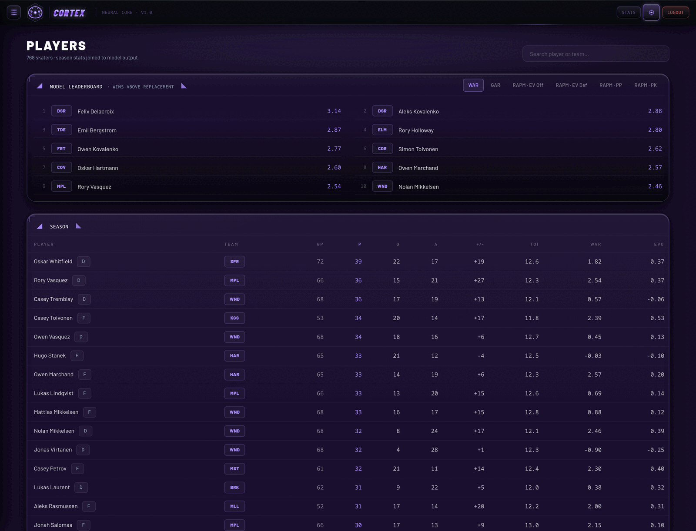
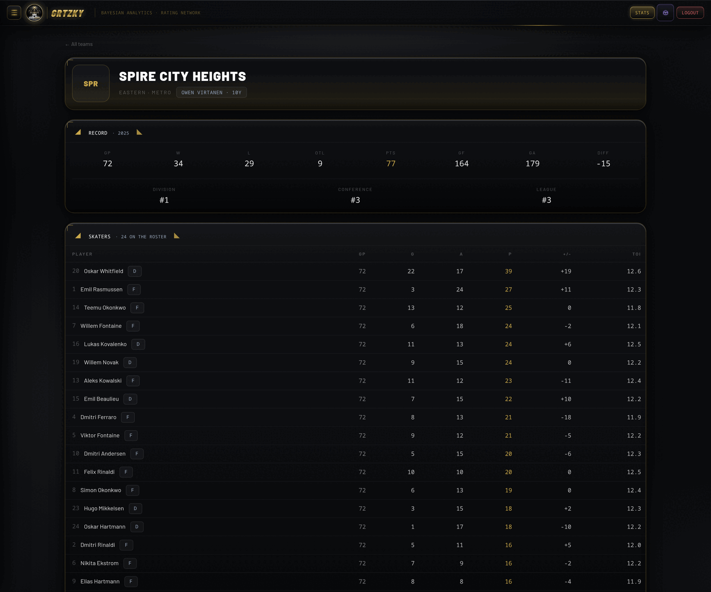
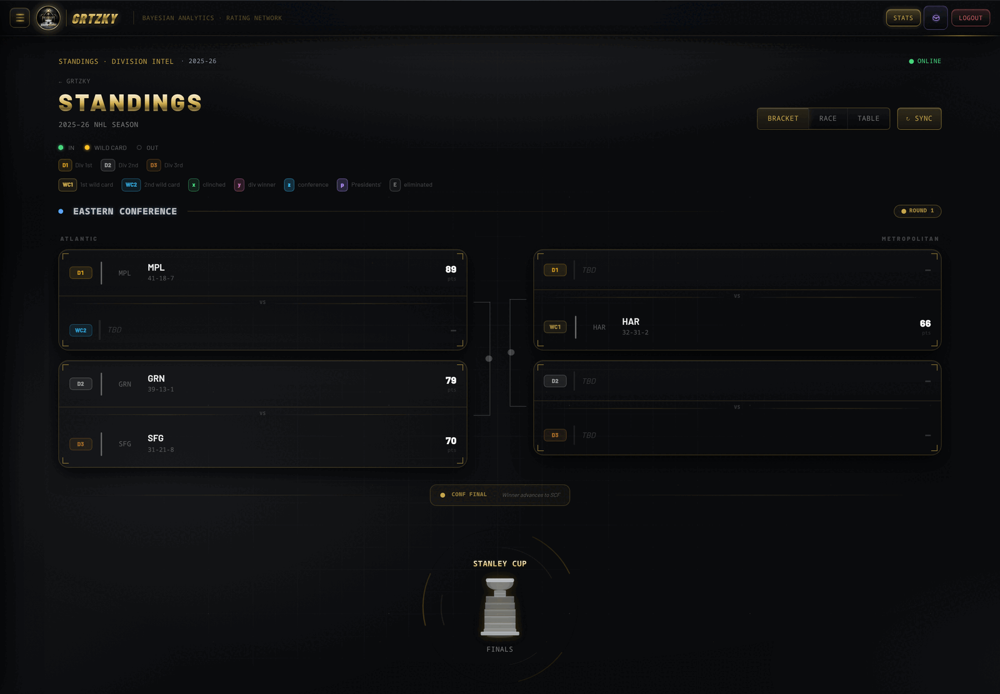
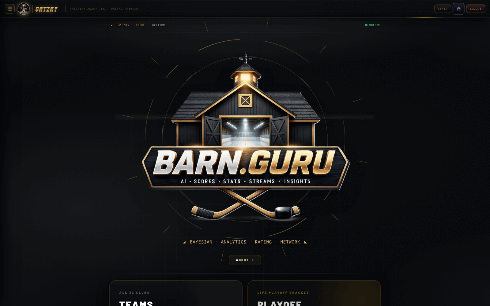
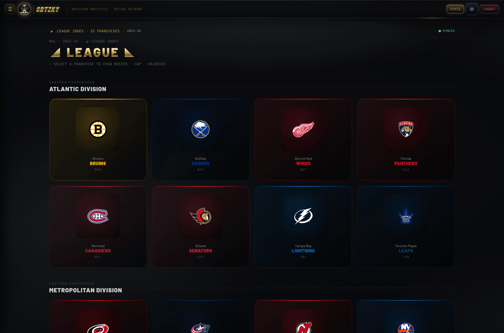

# GRTZKY

Hockey analytics: a library of statistical models, a simulation engine, and a
statistics dashboard that reads what the models produce.

Real NHL players and real season stats, from the league's public API. The RAPM
and WAR figures beside them are produced by the models in `models/` — run here
over simulated shift data, because shift-level events are not in any public feed.
The dashboard says so on every page that shows one.

```bash
uv sync --dev
uv run python scripts/fetch_nhl.py           # real rosters + stats (public API)
uv run python scripts/make_demo_data.py      # run the models over them
uv run uvicorn dashboard.api.main:app --port 8000

cd dashboard/frontend && npm install
cp .env.example .env.local && npm run dev    # → localhost:3000, demo/demo/demo
```

<p align="center">
  
  
</p>

---

## Table of contents

1. [What this is](#1-what-this-is)
2. [Screenshots](#2-screenshots)
3. [Running it](#3-running-it)
4. [The models](#4-the-models)
5. [The data pipeline](#5-the-data-pipeline)
6. [Does the model actually work?](#6-does-the-model-actually-work)
7. [The API](#7-the-api)
8. [Project layout](#8-project-layout)
9. [Engineering notes](#9-engineering-notes)
10. [License](#10-license)

---

## 1. What this is

Three layers, each usable without the ones above it:

| Layer | What it is |
| --- | --- |
| `models/` | ~30k lines of Python: RAPM, WAR/GAR, expected goals, Bayesian player ratings, line chemistry, matchup and deployment models |
| `scripts/` | `fetch_nhl.py` pulls real NHL data; `make_demo_data.py` drives the models over it |
| `dashboard/` | FastAPI reading the output + a Next.js statistics site |

Dependencies are deliberately small — polars, numpy, scikit-learn, scipy, joblib,
pyarrow, FastAPI. The models need nothing else.

### What is real, and what is not

This matters more than anything else in this README.

**Real** — fetched from the NHL's public API by `scripts/fetch_nhl.py`: every
player, club, position, ice time and counting stat. Goals, assists, points,
plus/minus, save percentage, standings. 920 skaters and 103 goaltenders.

**Simulated** — the shift-level and shot-level events the models are fitted on.
RAPM needs to know which ten skaters were on the ice for every shot attempt, and
no public endpoint publishes that. So the play is generated, anchored to each
player's real production rate.

Which means: **the RAPM and WAR numbers demonstrate the models; they do not
measure the players.** A leaderboard that looked authoritative while resting on
simulated play would be the dishonest version of this project. The player profile
puts the model's output next to the real production rating it was asked to
recover, so you can see the gap rather than take the figure on faith.

Nothing is redistributed: `data/` is git-ignored and rebuilt on your machine.

### This is a public demo build

The upstream project is private and does more — computer-vision tracking, live
game ingestion, a betting-edge surface, and a media layer. **None of that is
here.** This build is the statistics half.

---

## 2. Screenshots

| Player index | Player profile |
| --- | --- |
|  |  |

The profile is one request. Four ring gauges are the RAPM components; `Value`
converts them to goals and then wins; `By season` shows the daisy-chained prior
moving a rating across years.

| Team | Standings |
| --- | --- |
|  |  |

| Home | League |
| --- | --- |
|  |  |

---

## 3. Running it

Requires Python 3.11+, [uv](https://docs.astral.sh/uv/), and Node 20+.

```bash
# 1 — Python side
uv sync --dev
uv run python scripts/fetch_nhl.py --season 20242025
uv run python scripts/make_demo_data.py
uv run uvicorn dashboard.api.main:app --port 8000

# 2 — dashboard
cd dashboard/frontend
npm install
cp .env.example .env.local
npm run dev
```

Sign in with **`demo` / `demo` / `demo`** (username, password, secret word).
Change them in `.env.local`.

```bash
uv run pytest                       # model tests
uv run python scripts/make_demo_data.py --games 1312   # a full season
npm run build                       # dashboard production build
```

The Rust engine in `engine/` is optional and not required by anything above:

```bash
uv run maturin develop --manifest-path engine/Cargo.toml --release
```

---

## 4. The models

`models/` holds the analytics. The two the demo exercises end to end:

### RAPM — `models/rapm_model.py`

Regularized adjusted plus-minus: a ridge regression that separates a player's
on-ice impact from his teammates' and opponents'.

1. Build **stints** from shifts and shot events — every interval where the same
   ten skaters are on the ice, with the expected goals that occurred inside it.
2. Build a sparse design matrix, `+1` for attacking skaters, `-1` for defending,
   weighted by stint length.
3. Solve a weighted ridge with **per-player prior means**:

   ```
   min Σ wᵢ(yᵢ − Xᵢβ)² + λ Σ (βⱼ − μⱼ)²
   ```

   centred so it reduces to standard ridge on `β' = β − μ` and shifts back.
4. **Daisy-chain seasons**: this season's posterior, scaled by `PRIOR_WEIGHT`,
   becomes next season's prior. Veterans carry career signal forward; rookies
   start at league average.

Output is per player per season: EV offence, EV defence, PP, PK, plus TOI and xG
rates. Defensive components are measured as goals *allowed*, so a negative
coefficient is good — a detail that has to be respected everywhere downstream or
leaderboards silently invert.

### WAR / GAR — `models/war_model.py`

Converts RAPM into goals above replacement over the ice time actually played,
then into wins. Replacement level is measured from the player pool rather than
assumed — see [Engineering notes](#9-engineering-notes) for why that mattered.

### Also in the box

`xg_model` (expected goals), `bayesian_player_rating` (sequential conjugate
updating), `line_chemistry_model`, `matchup_model`, `clutch_index`,
`archetype_model`, `coach_profile`, `regime_change_detector`, and about seventy
more — not all wired into this demo, all readable.

---

## 5. The data pipeline

Two scripts, in order.

**`scripts/fetch_nhl.py`** pulls a season from two public, unauthenticated
endpoints — `api.nhle.com/stats/rest/en/{skater,goalie}/summary` and
`api-web.nhle.com/v1/standings/now`. These are the same JSON endpoints the
league's own site reads; no key, no account. Results are cached to `data/` so
everything downstream runs offline afterwards.

> The stats endpoint rejects most User-Agents. `curl/*` is accepted and is what
> the fetcher sends. If requests suddenly start returning 403, look there before
> you look at your network.

**`scripts/make_demo_data.py`** gives every skater a latent rating — real points
per 60, standardised across the league — then simulates a season of shifts and
shots from it and fits the models. Roughly 14% of ice time is special teams, so
the PP and PK components have something to estimate. Chance *quality*, not just
shot direction, depends on who is on the ice; without that the recovered
correlation collapses, because RAPM's target is expected goals.

Output:

```
data/demo/league.json          clubs and players          (real)
data/demo/<season>/            standings, skaters, goalies (real)
data/demo/skill.json           production rating per player
data/rapm/rapm_<season>.parquet  model output
data/war/war_<season>.parquet    model output
```

Seeded — the same arguments always produce the same fit.

## 6. Does the model actually work?

The simulator draws shot outcomes from each player's real production rating. The
model never sees that column — only shifts and shot events. So the two can be
compared:

```
$ uv run python scripts/make_demo_data.py --games 900
league: 32 clubs, 815 rated skaters (season 2025, source: NHL public API)
2025: 714,267 shift rows, 56,128 shots, 900 games simulated
  wrote data/rapm/rapm_2025.parquet — 811 players
  replacement level (from 30-player band): ev=-0.000 pp=+1.119 pk=-0.676
  wrote data/war/war_2025.parquet — 811 players
  corr(rapm_ev_off, production rating) = +0.445
```

**r ≈ 0.45** across 811 skaters. Not 0.95 — RAPM over a single season is a noisy
estimator, which is exactly why the production model chains priors across
seasons. Reporting the number rather than hiding it is the point.

Sanity also holds at the top of the board: Nathan MacKinnon appears in the top
five of both EV offence and WAR, which is what you would hope for from a fit that
never saw a box score.

The player profile shows the same comparison per player.

## 7. The API

`dashboard/api/main.py` — read-only, no database, no scheduler, no outbound calls.

| Endpoint | Returns |
| --- | --- |
| `/health` | seasons present, player count, which models are built |
| `/players` | season lines joined to RAPM + WAR |
| `/players/{id}` | profile, season line, multi-season model history |
| `/leaders/{metric}` | model leaderboards — `war`, `gar_total`, `rapm_ev_*` |
| `/standings` · `/teams/{abbrev}` · `/coaches` | league surfaces |
| `/skater-stats` · `/goalie-stats` | category leaders |

Model endpoints degrade rather than fail: with no parquet present they answer
`built: false` and the pages render their counting stats regardless.

The dashboard reaches all of it through one Next route handler
(`app/api/[...backend]/route.ts`) that proxies `/api/*` to `NEXT_PUBLIC_API_URL`.

---

## 8. Project layout

```
models/                 the analytics library
scripts/
  make_demo_data.py     simulate a season, run the models, write data/
dashboard/
  api/main.py           FastAPI over the generated data
  frontend/             Next.js 15 + React 19 + Tailwind v4
    app/players/        index + profile
    app/teams/          club pages
    app/stats/ standings/ coaches/
    components/hud/     the HUD primitives the pages are built from
engine/                 Rust possession simulator (PyO3, optional)
tests/                  model tests
data/                   generated — not committed
```

---

## 9. Engineering notes

**A +14 WAR league leader.** The first dataset had a best-player season roughly
triple what the best player in a real league posts. The cause was not the
simulation: `war_model` computes replacement level from the player pool, but ends
with a guard that discards the computed value if it is not below −0.5 goals/60 and
substitutes a calibrated constant of −2.0. That guard is correct for real data,
where ridge shrinkage pushes the replacement band well below average. A simulated
pool has no such shrinkage, so the guard fired every time and added a flat +2.0
goals/60 to all 768 players — about 32 goals each over a season. The generator now
computes the band itself and prints the number, because it is an assumption the
dataset rests on.

**Roster size is not cosmetic.** `ROSTER_SLOTS_SKATERS` is 640 (32 clubs × 20) and
replacement level is measured from the players ranked just *below* that cut. The
league started at 576 skaters, so that band did not exist and the calculation
silently fell back. Real seasons carry callups past the opening-night roster; the
generated one now does too.

**Shot quality, not just shot count.** With expected goals drawn independently of
who was on the ice, the only signal available to RAPM was which direction shots
went, and the recovered correlation sat at 0.12. Making chance quality depend on
the on-ice skill differential moved it to ~0.75 at the same sample size. The
target variable has to actually depend on the thing you are trying to measure.

**Signs matter more than magnitudes.** Defensive RAPM and PK RAPM are goals
*allowed*. Sorting them descending produces a leaderboard ranked exactly
backwards — which looks like a broken model rather than a broken sort. The API
returns an explicit `ascending` flag and the profile gauges invert before
filling.

---

## 10. License

MIT — see [LICENSE](LICENSE).

Player names, club names and statistics are factual records retrieved from the
NHL's public API at runtime. They are not redistributed by this repository and
are not covered by the licence above. NHL club marks are the property of their
owners; this project ships none of them.
